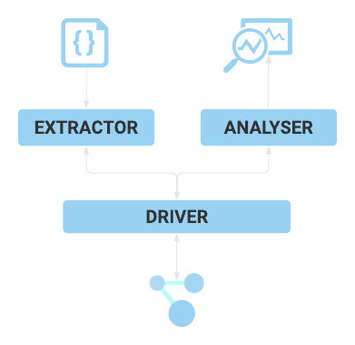
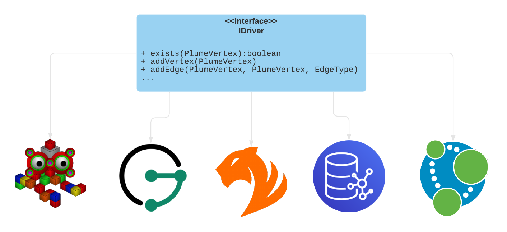
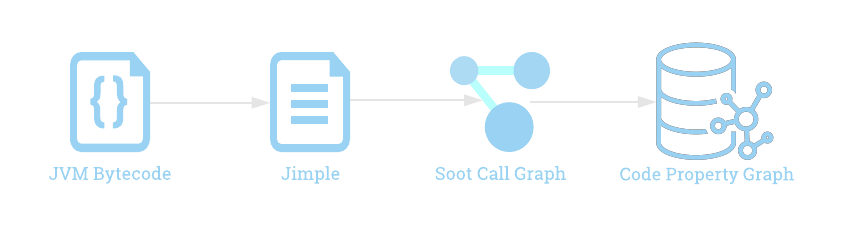

# Architectural Overview

{: align=right style="height:300px;width:300px" }

Plume is divided into three major parts: an extractor, an analyser, and a driver.
Each part can then be subdivided further but this separation of concerns allows for
each part of the CPG analysis lifecycle to be distributed between different parts of
a program.

## Driver

The driver provides the interface via which one can communicate to a chosen graph database.
This interface is defined by [`IDriver`](https://plume-oss.github.io/plume/kotlindoc/io/github/plume/oss/drivers/idriver/)
and is what is implemented by the database drivers such as the [TinkerGraph driver](https://plume-oss.github.io/plume/kotlindoc/io/github/plume/oss/drivers/tinkergraphdriver/) 
or [TigerGraph driver](https://plume-oss.github.io/plume/kotlindoc/io/github/plume/oss/drivers/tigergraphdriver/).

The extractor and analyser make use of the driver but one can use the driver independently to perform
one's own CPG construction or analysis. Currently there are only a handful of graph databases supported by
the driver but we are continually looking at supporting more graph databases.

## Extractor

The extractor is in charge of constructing the code property graph from bytecode. The entrypoint
for this component is the [`Extractor`](https://plume-oss.github.io/plume/kotlindoc/io/github/plume/oss/extractor/)
class where one can load and project the CPG using the given driver and classpath. 

Either source or class files can be loaded where source files will be compiled into class files.
The extractor makes use of [Soot](https://soot-oss.github.io/soot/) to convert the class files 
into Jimple from which the call graph is constructed. 
Soot's [`UnitGraph`](https://www.sable.mcgill.ca/soot/doc/soot/toolkits/graph/UnitGraph.html)
is used in order to construct the method bodies.

Due to the fact that Plume constructs the CPG from bytecode, the graph produced is not completely
interchangeable with the source code (and even less after the transformation to Jimple!) but line
number and dataflow information is accurately preserved.

## Analyser

The analyser is what performs analysis and updates on the CPG in the graph database. The analysis 
is performed incrementally and results stored on the graph in the form of dataflow edges or by
optimizations.

Note that the analyser is not available as of yet.