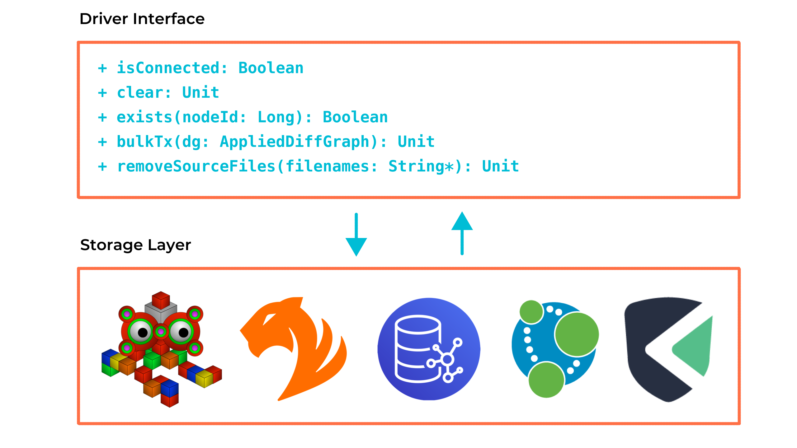

# Architectural Overview

Plume is divided into two major parts: an extractor and a driver. Each part can then be subdivided
further but this separation of concerns allows for each part of the CPG analysis lifecycle to be
distributed between different parts of a program.

## Driver

The driver provides the interface via which one can communicate to a chosen graph database. This
interface is defined by
[`IDriver`](https://plume-oss.github.io/plume/latest/api/com/github/plume/oss/drivers/IDriver.html) and is
what is implemented by the database drivers such as the [TinkerGraph
driver](https://plume-oss.github.io/plume/latest/api/com/github/plume/oss/drivers/TinkerGraphDriver.html)
or [TigerGraph
driver](https://plume-oss.github.io/plume/latest/api/com/github/plume/oss/drivers/TigerGraphDriver.html).

The extractor and analyser make use of the driver but one can use the driver independently to
perform one's own CPG construction or analysis. Currently there are only a handful of graph
databases supported by the driver but we are continually looking at supporting more graph databases.

## Extractor

The extractor is in charge of constructing the code property graph from bytecode. The entrypoint for
this component is the
[`Jimple2Cpg`](https://plume-oss.github.io/plume/latest/api/com/github/plume/oss/Jimple2Cpg.html) class
where one can load and project the CPG using the given driver and classpath. 

Either class or JAR files can be loaded. The extractor makes use of
[Soot](https://soot-oss.github.io/soot/) to convert the class files into Jimple from which the call
graph is constructed. Soot's
[`SootMethod`](https://www.sable.mcgill.ca/soot/doc/soot/SootMethod.html) is used in order to
construct the method bodies from AST information. AST ordering and control targets are then used to 
derive a CFG from which the rest of the dependencies and subgraphs are derived from.

Due to the fact that Plume constructs the CPG from bytecode, the graph produced is not completely
interchangeable with the source code (and even less after the transformation to Jimple!) but line
number and dataflow information is accurately preserved.
