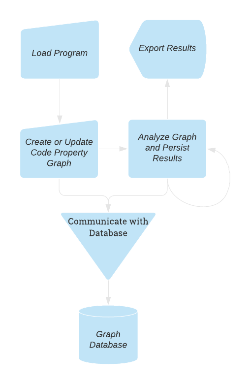

# Basic Usage

{: align=right style="height:450px;width:280px" }

## Introduction

The cycle of using Plume for static analysis starts with loading the program one wishes via the extractor.
This assumes one has already decided on what [storage backend](../storage-backends/introduction.md) they wish to use.
All source code for the example below with all supported storage backends can be found on the [examples repository](https://github.com/plume-oss/plume-examples) and the following tutorial is a simplied version of the `TinkerGraphApp` example.

## Setup and Configuration

To start, simply setup a Maven or Gradle project and [adding all the necessary dependencies](dependencies.md).
The Plume libraries can be obtained by running the following convience script which obtains the bleeding edge version
of the driver and extractor:

```bash
#!/bin/bash

# Download latest stable Plume libraries from the develop branches
rm -rf lib && mkdir -p lib && rm -rf ./tmp && mkdir -p ./tmp && cd ./tmp \
  && git init \
  && git remote add origin https://github.com/plume-oss/plume-driver.git \
  && git fetch --depth 1 origin develop \
  && git reset --hard FETCH_HEAD \
  && ./gradlew jar \
  && mv ./build/libs/plume-driver-X.X.X.jar ../lib/plume-driver-X.X.X.jar \
  && cd .. && rm -rf ./tmp && mkdir -p ./tmp && cd ./tmp \
  && git init \
  && git remote add origin https://github.com/plume-oss/plume-extractor.git \
  && git fetch --depth 1 origin develop \
  && git reset --hard FETCH_HEAD \
  && ./gradlew jar \
  && mv ./build/libs/plume-extractor-X.X.X.jar ../lib/plume-extractor-X.X.X.jar \
  && cd .. && rm -rf ./tmp \
```

## Creating a driver

Before we can extract our graph let's set up a simple in-memory driver.

=== "Java"
    ```java
    import za.ac.sun.plume.drivers.DriverFactory;
    import za.ac.sun.plume.drivers.GraphDatabase;
    import za.ac.sun.plume.drivers.TinkerGraphDriver;

    public class TinkerGraphApp {
        public static void main(String[] args) {
            TinkerGraphDriver driver = (TinkerGraphDriver) DriverFactory.invoke(GraphDatabase.TINKER_GRAPH);
            driver.connect();
        }
    }
    ```

=== "Kotlin"
    ```kotlin
    import za.ac.sun.plume.drivers.DriverFactory
    import za.ac.sun.plume.drivers.GraphDatabase
    import za.ac.sun.plume.drivers.TinkerGraphDriver

    class TinkerGraphApp {
        fun main(args : Array<String>) {
            val driver = (DriverFactory(GraphDatabase.TINKER_GRAPH) as TinkerGraphDriver).apply { connect() }
        }
    }
    ```

## Creating an extractor

Once we have a driver, we can instantiate our extractor. Our extractor takes the desired driver and the 
root directory (as a `File` object) of the classes we wish to analyse as arguments - this is how it 
discerns the classpath from the loaded classes. Let's assume the classes we want to analyze are next to
our `TinkerGraphApp` in a folder called `examples`.

=== "Java"
    ```java
    import za.ac.sun.plume.Extractor;
    import za.ac.sun.plume.drivers.DriverFactory;
    import za.ac.sun.plume.drivers.GraphDatabase;
    import za.ac.sun.plume.drivers.TinkerGraphDriver;

    public class TinkerGraphApp {
        public static void main(String[] args) {
            TinkerGraphDriver driver = (TinkerGraphDriver) DriverFactory.invoke(GraphDatabase.TINKER_GRAPH);
            driver.connect();
            Extractor extractor = new Extractor(driver, new File("./examples"));
        }
    }
    ```

=== "Kotlin"
    ```kotlin
    import za.ac.sun.plume.Extractor
    import za.ac.sun.plume.drivers.DriverFactory
    import za.ac.sun.plume.drivers.GraphDatabase
    import za.ac.sun.plume.drivers.TinkerGraphDriver

    class TinkerGraphApp {
        fun main(args : Array<String>) {
            val driver = (DriverFactory(GraphDatabase.TINKER_GRAPH) as TinkerGraphDriver).apply { connect() }
            val extractor = Extractor(driver, File("./examples"))
        }
    }
    ```

## Loading and projecting files

Next we would like to load the files we would like to extract the code property graph from. Classes can be loaded
as source files, class files, or a directory containing either. More on this can be found under 
[using the extractor](../plume-basics/extracting-cpg.md). 

For this example we will load the following file and store it under the package structure 
`intraprocedural/basic/Basic1.java` so the full path will be `./examples/intraprocedural/basic/Basic1.java`.

```java
package intraprocedural.basic;

public class Basic1 {

    public static void main(String[] args) {
        int a = 3;
        int b = 2;
        int c = a + b;
    }

}
```

Now let's load the file and project it to the graph database. The `load()` function adds arguments
to a queue and the `project()` function will project all loaded classes and clear the queue.

=== "Java"
    ```java
    File exampleFile = new File("./examples/intraprocedural/basic/Basic1.java");
    extractor.load(exampleFile);
    extractor.project();
    ```

=== "Kotlin"
    ```kotlin
    val exampleFile = File("./examples/intraprocedural/basic/Basic1.java")
    extractor.let { it.load(exampleFile); it.project() }
    ```

## Exporting and visualizing the graph

The code property graph is now constructed, in order to retrieve this from our in-memory database
let's export our graph. The `TinkerGraphDriver` supports importing and exporting graphs in GraphML,
GraphSON, and Gryo formats specified by the file extension `.xml`, `.json`, and `.kryo`. In this
example we will export the graph in GraphML format so that it can be visualized using [Cytoscape](https://cytoscape.org/).

```java
driver.exportGraph("./graph.xml");
```

With a bit of custom styling and using the `name` property as the displayed label for vertices and edges our
graph will look something like this:

