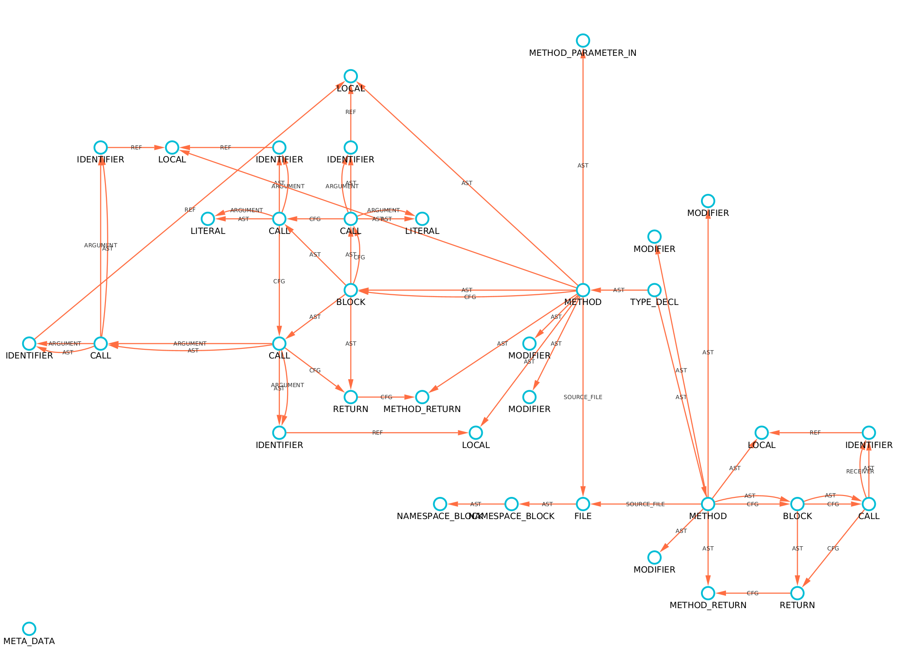

# Basic Usage

{: align=right style="height:450px;width:280px" }

## Introduction

The cycle of using Plume for static analysis starts with loading the target program via the
extractor. This assumes one has already decided on what [storage
backend](../storage-backends/introduction.md) one wishes to use. All source code for the example
below with all supported storage backends can be found on the [examples
repository](https://github.com/plume-oss/plume-examples) and the following tutorial is a simplied
version of the `TinkerGraphApp` example. 

Plume is coded to be as platform independent as possible but the examples below are simplified to
work only on Unix based systems for readability e.g. the use of forward-slashes when referencing the
file system. 

If using Windows, replace all forward-slashes with back-slashes in the examples below or make use of
`File.separator` constant.

## Setup and Configuration

To start, simply setup a Maven or Gradle project and [adding all the necessary dependencies](dependencies.md). Plume
can be pulled from JCenter as follows:

Remember to change `X.X.X` to [{: style="height:20px;width:40px;margin-bottom:-5px;object-fit:cover;object-position: 100% 0;" }](https://jitpack.io/#plume-oss/plume)

=== "Maven"
    ```mxml
    <dependency>
        <groupId>io.github.plume-oss</groupId>
        <artifactId>plume</artifactId>
        <version>X.X.X</version>
        <type>pom</type>
    </dependency>
    ```

=== "Gradle"
    ```groovy
    implementation 'io.github.plume-oss:plume:X.X.X'
    ```

The Plume libraries can be obtained by running the following convience script which obtains the
bleeding edge version:

```bash
#!/bin/bash

# Download latest stable Plume libraries
rm -rf lib && mkdir -p lib && rm -rf ./tmp && mkdir -p ./tmp && cd ./tmp \
  && git init \
  && git remote add origin https://github.com/plume-oss/plume.git \
  && git fetch --depth 1 origin develop \
  && git reset --hard FETCH_HEAD \
  && ./gradlew oneJar \
  && mv ./build/libs/plume-X.X.X.jar ../lib/plume-X.X.X.jar \
  && cd .. && rm -rf ./tmp
```

## Creating a driver

Before we can extract our graph let's set up a simple in-memory driver. Calling `.connect()` is
optional as the extractor will check if the driver is connected yet and, if not, will attempt to
call `.connect()` itself.

=== "Java"
    ```java
    import io.github.plume.oss.drivers.DriverFactory;
    import io.github.plume.oss.drivers.GraphDatabase;
    import io.github.plume.oss.drivers.TinkerGraphDriver;

    public class TinkerGraphApp {
        public static void main(String[] args) {
            TinkerGraphDriver driver = (TinkerGraphDriver) DriverFactory.invoke(GraphDatabase.TINKER_GRAPH);
            driver.connect(); // optional, but necessary if using the driver outside of the extractor
        }
    }
    ```

=== "Kotlin"
    ```kotlin
    import io.github.plume.oss.drivers.DriverFactory
    import io.github.plume.oss.drivers.GraphDatabase
    import io.github.plume.oss.drivers.TinkerGraphDriver

    class TinkerGraphApp {
        fun main(args : Array<String>) {
            val driver = (DriverFactory(GraphDatabase.TINKER_GRAPH) as TinkerGraphDriver).apply { connect() }
        }
    }
    ```

## Creating an extractor

Once we have a driver, we can instantiate our extractor. Our extractor takes the desired driver and
the root directory (as a `File` object) of the classes we wish to analyse as arguments - this is how
it discerns the classpath from the loaded classes. Let's assume the classes we want to analyze are
next to our `TinkerGraphApp` in a folder called `examples`.

=== "Java"
    ```java
    import io.github.plume.oss.Extractor;
    import io.github.plume.oss.drivers.DriverFactory;
    import io.github.plume.oss.drivers.GraphDatabase;
    import io.github.plume.oss.drivers.TinkerGraphDriver;

    public class TinkerGraphApp {
        public static void main(String[] args) {
            TinkerGraphDriver driver = (TinkerGraphDriver) DriverFactory.invoke(GraphDatabase.TINKER_GRAPH);
            Extractor extractor = new Extractor(driver);
        }
    }
    ```

=== "Kotlin"
    ```kotlin
    import io.github.plume.oss.Extractor
    import io.github.plume.oss.drivers.DriverFactory
    import io.github.plume.oss.drivers.GraphDatabase
    import io.github.plume.oss.drivers.TinkerGraphDriver

    class TinkerGraphApp {
        fun main(args : Array<String>) {
            val driver = DriverFactory(GraphDatabase.TINKER_GRAPH) as TinkerGraphDriver
            val extractor = Extractor(driver)
        }
    }
    ```

## Loading and projecting files

Next we would like to load the files we would like to extract the code property graph from. Classes
can be loaded as source files, class files, or a directory containing either. More on this can be
found under [using the extractor](../plume-basics/extracting-cpg.md). 

For this example we will load the following file and store it under the package structure
`intraprocedural/basic/Basic1.java` so the full path will be
`./examples/intraprocedural/basic/Basic1.java`.

```java
package intraprocedural.basic;

public class Basic1 {

    public static void main(String[] args) {
        int a = 3;
        int b = 2;
        int c = a + b;
    }

}
```

Now let's load the file and project it to the graph database. The `load()` function adds arguments
to a set and the `project()` function will project all loaded classes and clear the set. Note that
`load()` will throw exceptions if the given file does not exist or, in the case of a `.java` file,
fails to compile.

=== "Java"
    ```java
    File exampleFile = new File("./examples/intraprocedural/basic/Basic1.java");
    extractor.load(exampleFile);
    extractor.project();
    ```

=== "Kotlin"
    ```kotlin
    val exampleFile = File("./examples/intraprocedural/basic/Basic1.java")
    extractor.let { it.load(exampleFile); it.project() }
    ```

## Exporting and visualizing the graph

The code property graph is now constructed, in order to retrieve this from our in-memory database
let's export our graph. The `TinkerGraphDriver` supports importing and exporting graphs in GraphML,
GraphSON, and Gryo formats specified by the file extension `.xml`, `.json`, and `.kryo`. In this
example we will export the graph in GraphML format so that it can be visualized using
[Cytoscape](https://cytoscape.org/).

```java
driver.exportGraph("./graph.xml");
```

With a bit of custom styling, filtering, and using the `labelV` property as the displayed label for vertices and
edges our graph will look something like this (albeit it will be much more complex):



## Putting it all together

Since the driver implements `AutoCloseable`, we can combine the code from above where the driver
will automatically connect via the extractor and close via the try-with-resources notation.

=== "Java"
    ```java
    import io.github.plume.oss.drivers.DriverFactory;
    import io.github.plume.oss.drivers.GraphDatabase;
    import io.github.plume.oss.drivers.TinkerGraphDriver;
    import java.io.File;
    import java.io.IOException;

    public class TinkerGraphApp {
        public static void main(String[] args) throws IOException {
            try (TinkerGraphDriver driver = (TinkerGraphDriver) DriverFactory.invoke(GraphDatabase.TINKER_GRAPH)) {
                Extractor extractor = new Extractor(driver);
                File exampleFile = new File("./examples/intraprocedural/basic/Basic1.java");
                extractor.load(exampleFile);
                extractor.project();
            }
        }
    }
    ```

=== "Kotlin"
    ```kotlin
    import io.github.plume.oss.drivers.DriverFactory
    import io.github.plume.oss.drivers.GraphDatabase
    import io.github.plume.oss.drivers.TinkerGraphDriver
    import java.io.File
    import java.io.IOException

    class TinkerGraphApp {
        @Throws(IOException::class)
        fun main(args: Array<String>) {
            (DriverFactory.invoke(GraphDatabase.TINKER_GRAPH) as TinkerGraphDriver).use { driver ->
                val extractor = Extractor(driver)
                val exampleFile = File("./examples/intraprocedural/basic/Basic1.java")
                extractor.load(exampleFile)
                extractor.project()
            }
        }
    }
    ```