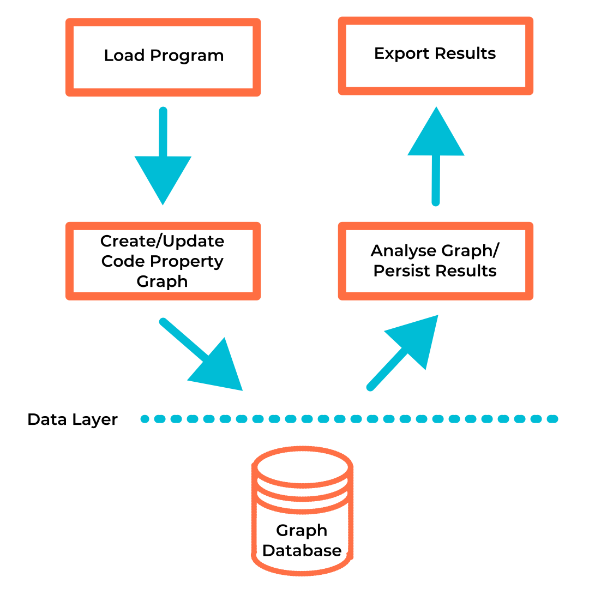

# Basic Usage

{: align=right style="height:400px;width:400px" }

## Introduction

The cycle of using Plume for static analysis starts with loading the target program via the
extractor. This assumes one has already decided on what [storage
backend](../storage-backends/introduction.md) one wishes to use. All source code for the example
below with all supported storage backends can be found on the [examples
repository](https://github.com/plume-oss/plume-examples) and the following tutorial is a simplified
version of the `TinkerGraphApp` example. 

Plume is coded to be as platform independent as possible but the examples below are simplified to
work only on Unix based systems for readability e.g. the use of forward-slashes when referencing the
file system. 

If using Windows, replace all forward-slashes with back-slashes in the examples below or make use of
`File.separator` constant.

## Setup and Configuration

Plume can be pulled from JitPack as follows:

Remember to change `X.X.X` to [{: style="height:20px;width:40px;margin-bottom:-5px;object-fit:cover;object-position: 100% 0;" }](https://jitpack.io/#plume-oss/plume)

```sbt
libraryDependencies += com.github.plume-oss % plume % X.X.X
```

The Plume libraries can be obtained by running the following convenience script which obtains the
bleeding edge version:

```bash
#!/bin/bash

# Download latest stable Plume libraries
rm -rf lib && mkdir -p lib && rm -rf ./tmp && mkdir -p ./tmp && cd ./tmp \
  && git init \
  && git remote add origin https://github.com/plume-oss/plume.git \
  && git fetch --depth 1 origin develop \
  && git reset --hard FETCH_HEAD \
  && sbt stage \
  && mv ./target/scala-2.13/plume_2.13-X.X.X.jar ../lib/plume_2.13-X.X.X.jar \
  && cd .. && rm -rf ./tmp
```

## Creating a driver

Before we can extract our graph let's set up a simple in-memory driver. The driver will create a
"connection" (i.e. create an instance of the backend) on creation of the driver object. e.g.

```scala
import com.github.plume.oss.drivers.OverflowDbDriver

object OverflowDbApp {

  def main(args: Array[String]): Unit = {
    val dbOutputFile = "cpg.odb"

    new OverflowDbDriver(
      storageLocation = Some(dbOutputFile)
    )
  }

}
```

## Extracting a CPG

Once we have a driver, we can extract a CPG from bytecode. Our extractor takes the desired driver
and the root directory (as a `String` path) of the classes we wish to analyse as arguments. Let's
assume the classes we want to analyze are next to our `TinkerGraphApp` in a folder called `example`.

```scala
import com.github.plume.oss.Jimple2Cpg
import com.github.plume.oss.drivers.TinkerGraphDriver

import scala.util.Using

object TinkerGraphApp {

  def main(args: Array[String]): Unit = {
    val targetDir = "./example"
    val dbOutputFile = "cpg.xml"

    println("Creating driver")
    Using.resource(new TinkerGraphDriver()) { d =>
      println(s"Creating CPG from .class files found under $targetDir")
      new Jimple2Cpg().createCpg(rawSourceCodePath = targetDir, driver = d)
      d.exportGraph(dbOutputFile)
    }
    println(s"Done! CPG persisted at $dbOutputFile")
  }

}
```

## Loading and projecting files

Next we would like to load the files we would like to extract the code property graph from. Classes
can be loaded as class files, JAR files, or a directory containing either.

For this example we will load the following file and store it under the package structure
`intraprocedural/basic/Basic1.java` so the full path will be
`./example/intraprocedural/basic/Basic1.java`.

```java
package intraprocedural.basic;

public class Basic1 {

    public static void main(String[] args) {
        int a = 3;
        int b = 2;
        int c = a + b;
    }

}
```

We can then compile the source code using `javac -g Basic1.java`. The `-g` argument adds debugging
information which helps map our results back to the source code. The `rawSourceCodePath` argument
can either be a file or directory. Now let's load the file and project it to the graph database.

```scala
val exampleFile = "./example/intraprocedural/basic/Basic1.class"
new Jimple2Cpg().createCpg(rawSourceCodePath = exampleFile, driver = d)
```

## Exporting and visualizing the graph

The code property graph is now constructed, in order to retrieve this from our in-memory database
let's export our graph. The `TinkerGraphDriver` supports importing and exporting graphs in GraphML,
GraphSON, and Gryo formats specified by the file extension `.xml`, `.json`, and `.kryo`. In this
example we will export the graph in GraphML format so that it can be visualized using
[Cytoscape](https://cytoscape.org/).

```java
driver.exportGraph("./graph.xml");
```

With a bit of custom styling, filtering, and using the `labelV` property as the displayed label for vertices and
edges our graph will look something like this (albeit it will be much more complex):


Alternatively, if one imports an `OverflowDB` binary into Joern then a dot file of the graph can
be generated.
