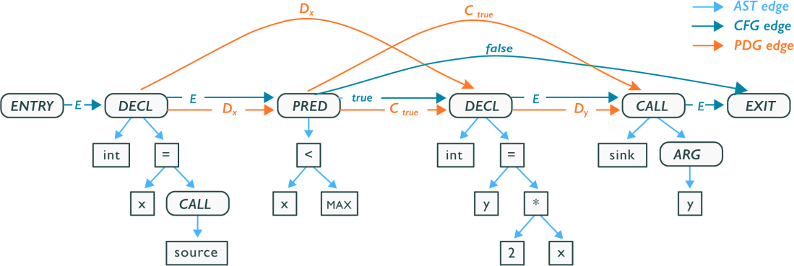

# The Code Property Graph

The inventor of the [code property graph](https://fabs.codeminers.org/papers/2014-ieeesp.pdf) and
Chief Scientist at ShiftLeft, Fabian Yamaguchi, explains that the code property graph is a concept
based on a simple observation: there are many different graph representations of code, and patterns
in code can often be expressed as patterns in these graphs. 

This schema is now primarily maintained by ShiftLeft and can be viewed on
[GitHub](https://github.com/ShiftLeftSecurity/codepropertygraph/blob/master/schema/src/main/resources/schemas/base.json).
Early implementations of this schema were seen on Neo4j and ShiftLeft's fork of TinkerGraph which
has now diverged significantly and known as
[OverflowDB](https://github.com/ShiftLeftSecurity/overflowdb).

Plume makes use of the concept of the code property graph and this is enforced by interacting with
the storage layer using the driver.

## Understanding the Code Property Graph

The code property graph merges three graph representations of code; namely abstract syntax trees,
control flow graphs and program dependence graphs, into a joint data structure. The following
illustration is taken from the paper ["Modeling and Discovering Vulnerabilities with Code Property
Graphs"](https://fabs.codeminers.org/papers/2014-ieeesp.pdf).

Since the property graph model is native to many popular graph database storage models the CPG can
be stored and queried within graph databases. The CPG explodes in size as programs get larger so
having scalability and resource management handled by a graph database simplifies this problem.

## Incremental Analysis

By persisting the graph in the database, one can also store results from the analysis on the stored
graph too. Examples of such analysis could be, by starting with a raw CPG, adding the dominator or
data-flow edges to the graph or performing constant propagation. This allows for code optimization
and the re-use of results.

Some analysis could further differentiate the program when compared to the source code but many
graph databases support multiple graphs and one could store snapshots before each analysis.

As one updates a part of the original code the whole graph does not need to be re-generated only the
affected subgraph. This allows for successive analysis to be much faster and updates to be minor.

## Language Agnostic

One major advantage of the concept of a CPG is that the projected graph is not language dependent.
This allows for re-use of many types of analysis as the analysis is written for the graph and not a
specific language.

Plume is currently aiming to do just that but currently only supports Java 8+.
