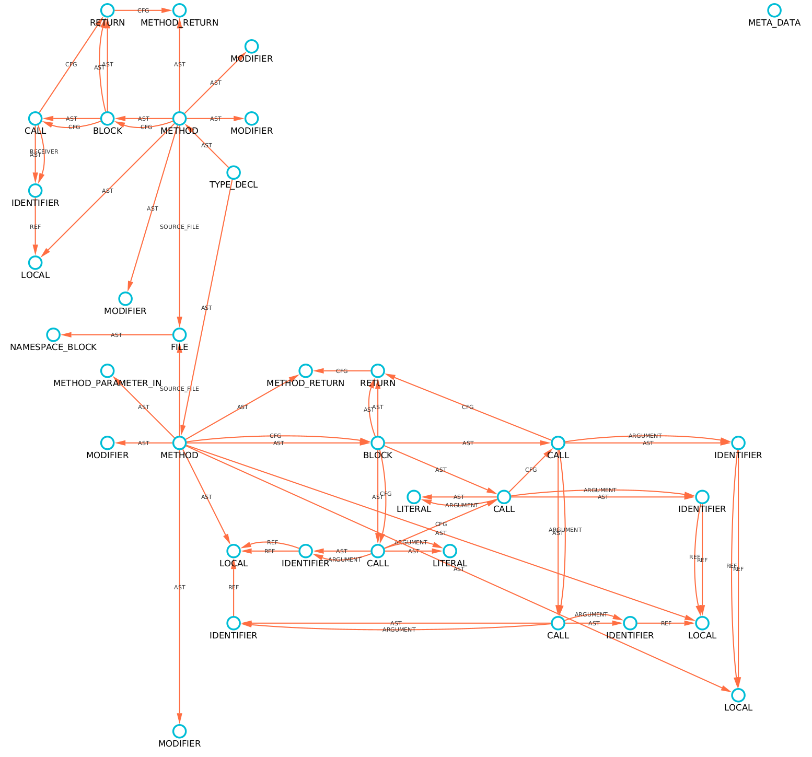
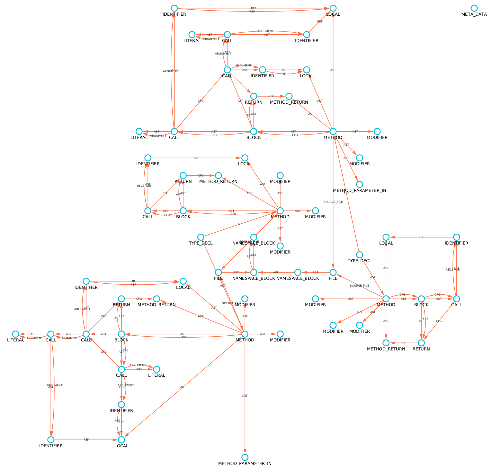

# Using the Extractor

All of the following graphs are constructed with the TinkerGraph driver and visualized with [Cytoscape](https://cytoscape.org/).
The code being projected is a simplified process taken from the extractor unit tests - specifically the 
[`ExtractorTest`](https://github.com/plume-oss/plume-extractor/blob/develop/src/test/kotlin/za/ac/sun/plume/ExtractorTest.kt) suite.

## Using the Extractor

The extractor uses Soot in order to extract the code-property graph from JVM bytecode. The extractor is constructed by accepting an
`IDriver` with which it will build the CPG and a `File` which acts as the target directory of the source files.

```kotlin
// The driver is what the extractor is going to use to build the graph with an determine
// which database is being written to. This will automatically connect in the extractor.
val driver = DriverFactory(GraphDatabase.TINKER_GRAPH) as TinkerGraphDriver
// The above to variables are the constructor arguments
val extractor = Extractor(driver)
```

Once we have a correctly configured driver, we can then load our classes:

```kotlin
// Load files and add them to the set of files
extractor.load(File("File1.java"))
extractor.load(File("File2.java"))
// or
listOf(File("File1.java"), File("File2.java")).forEach(extractor::load)

// Project all loaded files a remove them from the queue
extractor.project()
```

Once `project()` is called, all loaded classes will be projected to the storage backend as defined by the given `IDriver`.

## Extracting from a Source File

One can extract a CPG from a source file using `load()`. The class file is then compiled from the source file using
the installed JDK.

```kotlin
val targetFile = File("extractor_tests/Test1.java")
val driver = DriverFactory(GraphDatabase.TINKER_GRAPH) as TinkerGraphDriver
driver.use {
    val extractor = Extractor(it)
    extractor.load(targetFile)
    extractor.project()
    it.exportGraph("graph.xml")
}
```

### Source Code

=== "extractor_tests/Test1.java"
    ```java
    package extractor_tests;

    public class Test1 {

        public static void main(String[] args) {
            int a = 3;
            int b = 2;
            int c = a + b;
        }

    }
    ```

### Code Property Graph



## Extracting from a Class File

One can extract a CPG from a class file using `load()`. If the class file is compiled without debugging info (`-g` flag)
then all variable names will use placeholder names. This is the case with the example below.

```kotlin
val targetFile = File("extractor_tests/Test2.class")
val driver = DriverFactory(GraphDatabase.TINKER_GRAPH) as TinkerGraphDriver
driver.use {
    val extractor = Extractor(it)
    extractor.load(targetFile)
    extractor.project()
    it.exportGraph("graph.xml")
}
```

### Source Code

=== "extractor_tests/Test2.class"
    ```java
    package extractor_tests;

    public class Test2 {

        public static void main(String[] args) {
            int a = 3;
            int b = 2;
            int c = a - b;
        }

    }
    ```

### Code Property Graph


## Extracting from a Directory

One can extract all source and class files from a given directory using `load()`.

```kotlin
val targetDirectory = File("extractor_tests/dir_test")
val driver = DriverFactory(GraphDatabase.TINKER_GRAPH) as TinkerGraphDriver
driver.use {
    val extractor = Extractor(it)
    extractor.load(targetDirectory)
    extractor.project()
    it.exportGraph("graph.xml")
}
```

### Source Code

=== "extractor_tests/dir_test/Dir1.java"
    ```java
    package dir_test;

    public class Dir1 {

        public static void main(String[] args) {
            int a = 0;
            a += 1;
        }

    }
    ```

=== "extractor_tests/dir_test/pack/Dir2.java"
    ```java
    package dir_test.pack;

    public class Dir2 {

        public static void main(String[] args) {
            int a = 0;
            a -= 1;
        }

    }
    ```

### Code Property Graph



## Updating the CPG

If source code changes, one does not need to delete and regenerate the whole graph.
`FileVertex` objects contain a hash of the file which generate that subgraph. If that
same file is extracted and the hash differs from what is in the database, then that
subgraph is dropped and the respective CPG is re-generated. If no hash change is detected 
then nothing is extracted and the graph will remain the same.

This hash is on source file level and not method level i.e. if one method changes then 
everything from the parent source file is dropped and recreated.

The hash used is XXH32 from [xxHash](http://cyan4973.github.io/xxHash/) which is a fast
and non-cryptographic hash.

In order to update the graph simply extract the changed source file over the graph
database containing the existing CPG.
