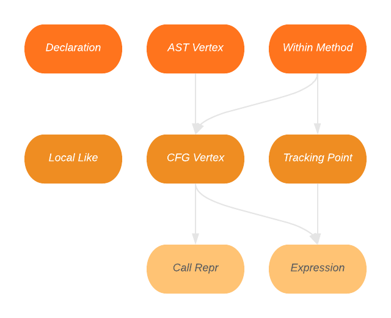

# Schema

The latest CPG schema as defined by ShiftLeft is extremely complex in the sense that there is a large number of unique vertex types and possible permutations of which edges may be permitted between different vertex types. To simplify this complexity, vertices are subdivided by base traits and inherit properties accordingly.

## Base Traits

{: align=right style="height:300px;width:400px" }

A vertex can inherit either none or many base traits. Traits are created as abstract classes which are more formally described in the [KDoc](https://plume-oss.github.io/plume-driver/kotlindoc/za/ac/sun/plume/domain/models/). 

Base traits can also inherit properties from one another e.g. a CFG Vertex inherits properties from the AST Vertex and Within Method base traits.

## Vertex Types

| Vertex Label | Description | Traits |
|-|-|-|
| META_DATA | Node to save meta data about the graph on its properties. Exactly one node of this type per graph. |  |
| FILE | Node representing a source file. Often also the AST root. | AST_NODE |
| METHOD | A method/function/procedure. | DECLARATION, CFG_NODE, AST_NODE |
| METHOD_PARAMETER_IN | This node represents a formal parameter going towards the callee side. | DECLARATION, LOCAL_LIKE, TRACKING_POINT, AST_NODE |
| METHOD_RETURN | A formal method return. | CFG_NODE, TRACKING_POINT |
| MODIFIER | A modifier, e.g., static, public, private. | AST_NODE |
| TYPE | A type which always has to reference a type declaration and may have type argument children if the referred to type declaration is a template. |  |
| TYPE_DECL | A type declaration. | AST_NODE |
| BINDING | A binding of a METHOD into a TYPE_DECL. |  |
| TYPE_PARAMETER | Type parameter of TYPE_DECL or METHOD. | AST_NODE |
| TYPE_ARGUMENT | Argument for a TYPE_PARAMETER that belongs to a TYPE. It binds another TYPE to a TYPE_PARAMETER. | AST_NODE |
| MEMBER | Member of a class struct or union. | DECLARATION, AST_NODE |
| NAMESPACE_BLOCK | A reference to a namespace. | AST_NODE |
| LITERAL | Literal/Constant. | EXPRESSION |
| CALL | A (method)-call. | EXPRESSION, CALL_REPR |
| LOCAL | A local variable. | DECLARATION, LOCAL_LIKE, AST_NODE |
| IDENTIFIER | An arbitrary identifier/reference. | EXPRESSION, LOCAL_LIKE |
| FIELD_IDENTIFIER | A node that represents which field is accessed in a <operator>.fieldAccess, in e.g. obj.field. The CODE part is used for human display and matching to MEMBER nodes. The CANONICAL_NAME is used for dataflow tracking; typically both coincide. However, suppose that two fields foo and bar are a C-style union; then CODE refers to whatever the programmer wrote (obj.foo or obj.bar), but both share the same CANONICAL_NAME (e.g. GENERATED_foo_bar) | EXPRESSION |
| RETURN | A return instruction. | EXPRESSION |
| BLOCK | A structuring block in the AST. | EXPRESSION |
| ARRAY_INITIALIZER | Initialization construct for arrays. | AST_NODE |
| METHOD_REF | Reference to a method instance. | EXPRESSION |
| TYPE_REF | Reference to a type/class. | EXPRESSION |
| CONTROL_STRUCTURE | A control structure such as if, while, or for. | EXPRESSION |
| JUMP_TARGET | A jump target made explicit in the code using a label. | CFG_NODE, AST_NODE |
| UNKNOWN | A language-specific node. | EXPRESSION |

## Edge Types

| Edge Label | Description |
|-|-|
| AST | Syntax tree edge. |
| CFG | Control flow edge. |
| CAPTURED_BY | Connection between a captured LOCAL and the corresponding CLOSURE_BINDING. |
| BINDS_TO | Type argument binding to a type parameter. |
| REF | A reference to e.g. a LOCAL. |
| RECEIVER | The receiver of a method call which is either an object or a pointer. |
| CONDITION | Edge from control structure node to the expression that holds the condition. |
| BINDS | Relation between TYPE_DECL and BINDING node. |
| ARGUMENT | Relation between a CALL and its arguments and RETURN and the returned expression. |
| SOURCE_FILE | Source file of a node, in which its LINE_NUMBER and COLUMN_NUMBER are valid. |