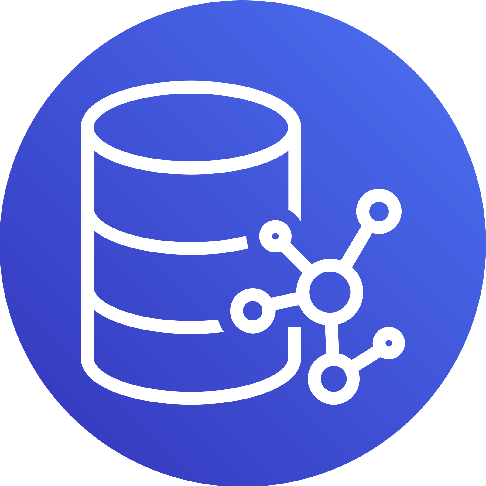

# Amazon Neptune

{: align=right style="height:150px;width:150px" }

> Amazon Neptune is a fast, reliable, fully managed graph database service that makes it easy to
> build and run applications that work with highly connected datasets. The core of Amazon Neptune is
> a purpose-built, high-performance graph database engine optimized for storing billions of
> relationships and querying the graph with milliseconds latency.
>
>  —  [Amazon Neptune Homepage](https://aws.amazon.com/neptune/)

Amazon Neptune supports open graph APIs for both Gremlin and SPARQL where Plume communicates with
Neptune using the former. Neptune does not expose it's API publically and must be queried via an EC2
instance in the same VPC as the Neptune cluster. More on this can be found on the
[documentation](https://docs.aws.amazon.com/neptune/latest/userguide/get-started-vpc-dns.html).

## Driver Configuration and Usage

Neptune's driver can be created as follows:
```kotlin
val driver = (DriverFactory(GraphDatabase.NEPTUNE) as NeptuneDriver).apply { 
        addHostnames("<cluster hostnames here>")
            .port(8182)
            .keyCertChainFile("src/test/resources/conf/SFSRootCAG2.pem")
            .connect()
    }
```

The driver provides a wrapper over the
[`Cluster`](https://tinkerpop.apache.org/javadocs/current/full/org/apache/tinkerpop/gremlin/driver/Cluster.html)
builder and the process can be found in the
[documentation](https://docs.aws.amazon.com/neptune/latest/userguide/access-graph-gremlin-java.html).
One may only communicate via Neptune using HTTPS and thus the `enableSsl` is automatically set to
true where the default port is 8182 if not specified. When using Neptune outside of production the
`keyCertChainFile` need not be specified.

## Ideal Use Case

Amazon Neptune forms part of the larger AWS cloud infrastructure as the primary graph database
service. If one's services are run on AWS then Neptune would be a seamless fit within the existing
ecosystem. Amazon Neptune supports popular graph models Property Graph and W3C's RDF, and their
respective query languages Apache TinkerPop Gremlin and SPARQL useful for if both models are
required by a single service.

Neptune is designed to be highly available, durable, and fault tolerant for systems that aren't
allowed to fail.

### Benefits

The following benefits are obtained from the Neptune homepage:

- Supports open graph APIs Gremlin and SPARQL.
- High performance and scalability by supporting up to 15 low latency read replicas across three
  Availability Zones to scale read capacity and execute more than one-hundred thousand graph queries
  per second.
- Highly available, durable, and ACID (Atomicity, Consistency, Isolation, Durability) compliant.
  Neptune is designed to provide greater than 99.99% availability.
- It features fault-tolerant and self-healing storage built for the cloud that replicates six copies
  of your data across three Availability Zones. Neptune continuously backs up your data to Amazon
  S3, and transparently recovers from physical storage failures.
- Multiple levels of security for your database, including network isolation using Amazon VPC,
  support for IAM authentication for endpoint access, HTTPS encrypted client connections, encryption
  at rest using keys you create and control through AWS Key Management Service (KMS).
- Database management tasks such as hardware provisioning, software patching, setup, configuration,
  or backups are fully managed.

### Limitations

The following notable limitations are extracted from
[this page](https://docs.aws.amazon.com/neptune/latest/userguide/limits.html):

- There is a size limit of 55 MB on the size of an individual property or label. In RDF terms, this
  means that the value in any column (S, P, O or G) of an RDF quad cannot exceed 55 MB. If you need
  to associate a larger object such as an image with a vertex or node in your graph, you can store
  it as a file in Amazon S3 and use the Amazon S3 path as the property or label.
- Most regions require an SSL connection.
- Each AWS account has limits for each Region on the number of Amazon Neptune and Amazon RDS
  resources that you can create. These resources include DB instances and DB clusters. After you
  reach a limit for a resource, additional calls to create that resource fail with an exception.
- Amazon Neptune is a virtual private cloud (VPC)–only service. Additionally, instances do not allow
  access from outside the VPC.