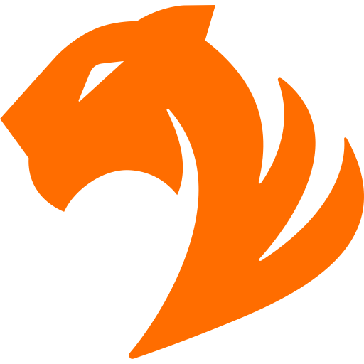

# TigerGraph

{: align=right style="height:150px;width:150px" }

>TigerGraph is the world’s fastest graph analytics platform designed to unleash the power of interconnected data for deeper insights and better outcomes. TigerGraph fulfills the true promise and benefits of the graph platform by tackling the toughest data challenges in real time, no matter how large or complex the dataset. TigerGraph supports applications such as IoT, AI and machine learning to make sense of ever-changing big data.
>
> —  [TigerGraph About](https://www.tigergraph.com/about/)

TigerGraph is a native parallel graph with a C++ codebase. Plume communicates with TigerGraph via a REST interface which can be secured with HTTPS and an authentication token. Since TigerGraph uses a schema there is additional setup beforehand but this is made simple by making use of Docker.

## Driver Configuration and Usage

Since TigerGraph makes use of REST, it only requires server information and (optionally) an authentication e.g. when using [TigerGraph Cloud](https://www.tigergraph.com/cloud/). The driver is created as follows:
```kotlin
val driver = (DriverFactory(GraphDatabase.TIGER_GRAPH) as TigerGraphDriver)
```
By default the hostname will be 127.0.0.1, port 9000 and protocol HTTP. To change this, one can call the builder-style methods:
```kotlin
driver.hostname("127.0.0.1") // Set host
        .port(9000) // Set port
        .secure(false) // Determine protocol (false for HTTP and true for HTTPS)
        .authKey("secret_token") // Set authentication token for request header
```
Once a configuration is changed the next request will immediately use the new details so one does not have to create a new driver object.

In the current version, Plume will make use of a graph called "cpg". The schema use for TigerGraph can be found [here](https://github.com/plume-oss/plume-driver/blob/develop/src/test/resources/conf/tg-schema.gsql).

## Ideal Use Case

TigerGraph is fast and efficient both in terms of storage and memory consumption. TigerGraph provides a developer and enterprise edition but one can easily get started with a free [TigerGraph Cloud](https://www.tigergraph.com/cloud/) instance if resources are limited. Like TinkerGraph, TigerGraph is ideal for graph exploration as it comes with a built-in graph visualizer using GraphStudio.

### Benefits

- Free to use for development and the TigerGraph Cloud free tier instance comes with a generous resource allocation.
- Distributed capabilities and ACID compliant.
- Fast execution of parallel graph algorithms.
- Real-time capability for streaming updates and inserts using REST.
- Ability to unify real-time analytics with large-scale offline data processing.
- Ability to traverse hundreds of millions of vertices/edges per second per machine.
- Ability to load 50 to 150 GB of data per hour, per machine.
- Ability to stream 2B+ daily events in real-time.
- High compression rates for low resource consumption.

### Limitations

- Enforced schema requires compulsory setup to use with Plume.
- Requires a license for enterprise application.

## TigerGraph Schema

Due to pattern matching queries requiring knowledge of the edge type and the way edge restrictions work, there are
only two vertex types. `META_DATA_VERT` contains language data and `CPG_VERT` represents all CPG vertices where 
the Plume driver will use the `label` property to determine which of the other properties to serialize and use.

```gsql
# Vertices

## Basic CPG vertex
CREATE VERTEX CPG_VERT (
    PRIMARY_ID id INT,
    label STRING DEFAULT "UNKNOWN",
    argumentIndex INT DEFAULT -1,
    dispatchType STRING DEFAULT "STATIC_DISPATCH",
    evaluationStrategy STRING DEFAULT "BY_REFERENCE",
    methodFullName STRING DEFAULT "null",
    methodInstFullName STRING DEFAULT "null",
    typeFullName STRING DEFAULT "null",
    typeDeclFullName STRING DEFAULT "null",
    dynamicTypeHintFullName STRING DEFAULT "null",
    code STRING DEFAULT "null",
    columnNumber INT DEFAULT -1,
    lineNumber INT DEFAULT -1,
    name STRING DEFAULT "null",
    fullName STRING DEFAULT "null",
    canonicalName STRING DEFAULT "null",
    astOrder INT DEFAULT -1,
    signature STRING DEFAULT "()"
)
## Language Dependent
CREATE VERTEX META_DATA_VERT (
    PRIMARY_ID id INT,
    label STRING DEFAULT "META_DATA",
    language STRING DEFAULT "JAVA",
    version STRING DEFAULT "1.8"
)

# Edges

CREATE DIRECTED EDGE AST (FROM CPG_VERT, TO CPG_VERT)
CREATE DIRECTED EDGE CFG (FROM CPG_VERT, TO CPG_VERT)
CREATE DIRECTED EDGE CAPTURED_BY (FROM CPG_VERT, TO CPG_VERT)
CREATE DIRECTED EDGE BINDS_TO (FROM CPG_VERT, TO CPG_VERT)
CREATE DIRECTED EDGE REF (FROM CPG_VERT, TO CPG_VERT)
CREATE DIRECTED EDGE RECEIVER (FROM CPG_VERT, TO CPG_VERT)
CREATE DIRECTED EDGE CONDITION (FROM CPG_VERT, TO CPG_VERT)
CREATE DIRECTED EDGE BINDS (FROM CPG_VERT, TO CPG_VERT)
CREATE DIRECTED EDGE ARGUMENT (FROM CPG_VERT, TO CPG_VERT)
CREATE DIRECTED EDGE SOURCE_FILE (FROM CPG_VERT, TO CPG_VERT)
```